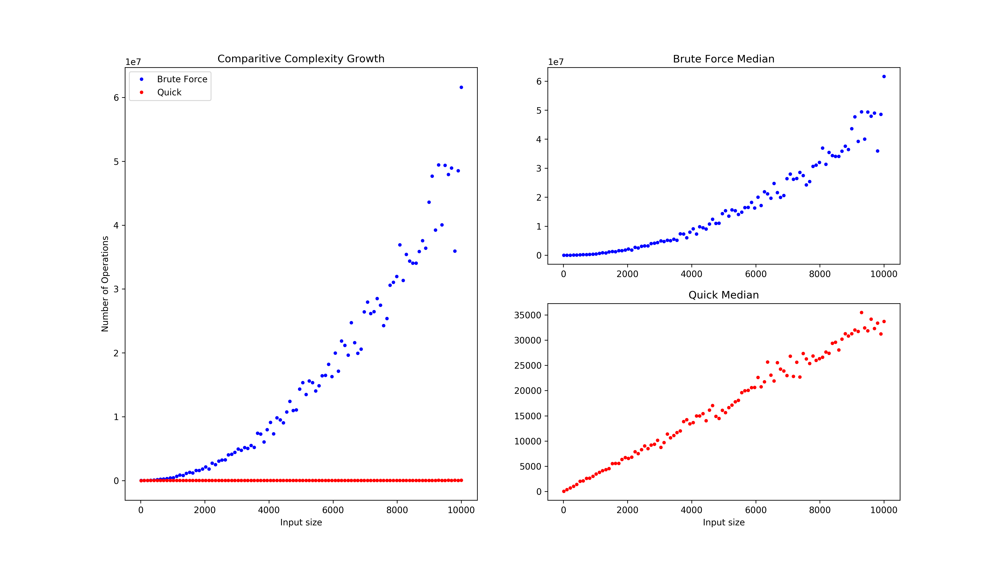

# Empirical Analysis of Median-finding Algorithms
For the final assignment of the algorithms unit at our university, we performed theoretical and then empirical average-case analysis of two different median-finding algorithms. This repository hosts the source code we wrote to perform the empirical analysis.

We measured the execution time and the number of basic operations for a number of input sizes to observe the complexity and order of growth for these algorithms, which we then compared with our theoretical results.

Two of the components are written in C++ - the timing functionality and the random number generation. The timing function is written in C++ because standard C doesn't provide a cross-platform way to access the monotonic clock, but standard C++ does (since C++11). We use the monotonic clock because it's guaranteed that subtracting its value between two time points will give the elapsed time, even if the user changes their system clock. 

Random number generation uses C++'s standardised Merseinne Twister (`std::mt19937`, also introduced in C++11), which is [guaranteed to do the uniform random number generation well](https://en.cppreference.com/w/cpp/numeric/random/mersenne_twister_engine), which was important as we needed to measure the average case. However, the quality of the generation in C's `rand()` [is not guaranteed](https://en.cppreference.com/w/cpp/numeric/random/rand).

Everything else, including the implementation of the algorithms themselves, was written in C because, other than C# and Java, this was the programming language common to both of us. Furthermore, using C meant we were closer to the hardware, eliminating the interference (from garbage collection, JIT compilation, etc.) typical of these languages, which was vital for clean execution-time results.

# Results
Growth of basic operations count:

Execution time growth:

We therefore conclude that Brute Force Median is O(n^2), while Quick Median is O(n).

And to gauge how representative of the algorithm our choice of basic operation is:

We should see a perfect linear correspondence here - more basic operations should lead to more time spent by the algorithm. This is the case for Quick Median (with some variation). However, for Brute Force Median, we can see that the variation is much worse. On further investigation, we concluded that, due to the nested loops of Brute Force Median, this was due to the compiler's use of the SSE registers to perform SIMD operations (the program was compiled and run on an x86_64 processor). To avoid this optimisation for the purposes of a more direct and fair comparison between the two algorithms, the compiler flag `-O0` should have explicitly been set.
